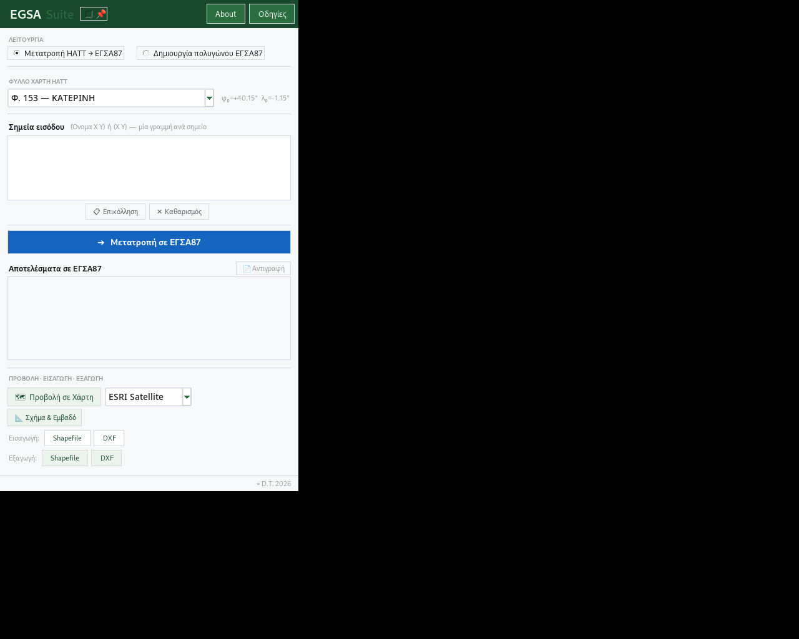

# EGSA Suite

**Desktop coordinate and geometry utility for Greek GIS/CAD workflows.**  
HATT → EGSA87 transformations, EGSA87 geometry tools, Shapefile/DXF exchange, map preview and
Google Earth Pro integration.

> **Current public-release candidate:** `v5.4.0-beta.3`



## Γιατί υπάρχει

Το EGSA Suite δημιουργήθηκε για καθημερινές εργασίες με παλαιότερα δεδομένα HATT και σύγχρονα
data σε ΕΓΣΑ87, ιδιαίτερα σε περιβάλλοντα όπου χρειάζεται γρήγορη μεταφορά κορυφών ανάμεσα σε
GIS, CAD και Google Earth. Στόχος είναι να είναι ένα πρακτικό δωρεάν εργαλείο για συναδέλφους και
τεχνικούς χρήστες στην Ελλάδα, χωρίς να απαιτείται εμπορικό λογισμικό μόνο για τις βασικές αυτές
μετατροπές.

## Δυνατότητες

- HATT → ΕΓΣΑ87 με 390 εγγραφές πολυωνυμικού μετασχηματισμού.
- Επιλογή και μόνιμη αποθήκευση προεπιλεγμένου φύλλου HATT ανά χρήστη.
- Άμεση εισαγωγή/επεξεργασία συντεταγμένων ΕΓΣΑ87.
- Εμβαδόν, αποστάσεις και οπτικός έλεγχος πολυγώνου.
- Έλεγχος αυτοτομών και βασικών σφαλμάτων γεωμετρίας πριν από export.
- Import/export Shapefile με CRS check για EPSG:2100.
- Ασφαλής επιλογή feature/part σε multi-feature ή multipart Shapefile.
- Ανάγνωση κοινών `.cpg` encodings για παλαιότερα ελληνικά DBF attributes (π.χ. CP1253).
- Import/export DXF με επιλογή polyline και έλεγχο μονάδων/εύρους.
- Στην εξαγωγή DXF, τα POINT entities και τα ονόματα κορυφών (TEXT) είναι ανεξάρτητες προαιρετικές επιλογές.
- Προβολή σε χάρτη και Google Maps.
- Google Earth Pro live NetworkLink και camera tracking μέσω local-only HTTP server (`127.0.0.1`).

## Γρήγορη χρήση στα Windows

Για τους περισσότερους χρήστες η προτεινόμενη διανομή είναι το έτοιμο portable Windows build από
τη σελίδα **Releases** του GitHub. Δεν απαιτείται εγκατάσταση Python.

Σε unsigned beta builds, το Windows SmartScreen μπορεί να εμφανίσει προειδοποίηση "Unknown
publisher". Πριν εκτελέσεις binary από οποιαδήποτε πηγή, επιβεβαίωσε ότι προέρχεται από το επίσημο
repository/release.

## Εκτέλεση από source

Απαιτείται Python 3.13 ή 3.14.

```bash
python -m venv .venv
.venv\Scripts\activate
python -m pip install -r requirements.txt
python geotoolsgr.py
```

Το Google Earth Pro είναι προαιρετικό· οι υπόλοιπες λειτουργίες μπορούν να χρησιμοποιηθούν χωρίς
αυτό.

## Tests

```bash
python -m pip install -r requirements-dev.txt
set EGSA_SUITE_NO_SPLASH=1
python -m pytest -q
```

Το repository περιλαμβάνει CI σε Windows για Python 3.13 και 3.14.

## Build Windows executable

Δες το [BUILDING.md](BUILDING.md). Το `build_exe.bat` δημιουργεί το executable και ένα release ZIP
που περιλαμβάνει επίσης τις άδειες και τα third-party notices.

## Σημαντική προειδοποίηση για HATT

Οι συντελεστές HATT της `v5.4.0-beta.3` έχουν επανελεγχθεί με βασική πηγή την επίσημη ιστορική
έκδοση **ΟΚΧΕ / ΓΥΣ / ΕΜΠ** των πινάκων HATT → ΕΓΣΑ87. Η beta.3 διορθώνει σφάλματα μεταγραφής
που εντοπίστηκαν σε παλαιότερο ηλεκτρονικό πίνακα και δεν πρέπει να αντικαθίσταται από beta.1 ή
beta.2 για νέες μετατροπές HATT.

Η ίδια η επίσημη έκδοση διευκρινίζει ότι τα πολυώνυμα προορίζονται για ένταξη χαρτογραφικών
εργασιών και **δεν παρέχουν γεωδαιτική ακρίβεια**. Η εφαρμογή τους προϋποθέτει επίσης τη σωστή
ταυτότητα/υλοποίηση των αρχικών HATT συντεταγμένων, ιδίως ως προς τα δεδομένα μετά την τμηματική
συνόρθωση των δικτύων μετά το 1963.

Η εγγραφή **ΝΗΣΟΣ ΜΕΓΙΣΤΗ (ΚΑΣΤΕΛΛΟΡΙΖΟ)** παραμένει ειδική περίπτωση: οι ασυνήθιστες σταθερές
της επιβεβαιώνονται από την ίδια την επίσημη έκδοση, επομένως δεν τροποποιούνται αυθαίρετα. Το
EGSA Suite εμφανίζει ειδική προειδοποίηση πριν από τη χρήση της.

Δες [DATA_SOURCES.md](DATA_SOURCES.md) για την επίσημη προέλευση, τη σημειογραφία, τα όρια χρήσης
και τις λεπτομέρειες του ελέγχου δεδομένων.

## Shapefile behaviour

Το EGSA Suite **δεν κάνει αυτόματο reprojection** άγνωστων Shapefiles. Ελέγχει το `.prj` με
`pyproj` και, αν δεν αναγνωρίζεται ως EPSG:2100, ο χρήστης πρέπει να αποφασίσει αν θα συνεχίσει.
Σε αρχεία με πολλά features ή multipart geometries η εφαρμογή ζητά να επιλεγεί συγκεκριμένο
feature/part αντί να ενώσει διαφορετικές γεωμετρίες.

## Geometry convention

- 1 σημείο → POINT
- 2 σημεία → POLYLINE
- 3+ σημεία → POLYGON

Η τρέχουσα desktop ροή θεωρεί ότι 3+ κορυφές αποτελούν κλειστό πολύγωνο.

## Open source & credits

Το EGSA Suite διανέμεται με άδεια **MIT**. Δες [LICENSE](LICENSE).

Η λειτουργία Google Earth βασίζεται εν μέρει και προσαρμόζει στοιχεία από το open-source
[egsa2ge](https://github.com/dasaki-greece/egsa2ge), επίσης με άδεια MIT. Οι πλήρεις σχετικές
σημειώσεις και άδειες βρίσκονται στο [THIRD_PARTY_NOTICES.md](THIRD_PARTY_NOTICES.md) και στον
φάκελο `licenses/`.

## Disclaimer

Το EGSA Suite είναι εργαλείο υποβοήθησης και δεν αντικαθιστά επίσημη γεωδαιτική μελέτη,
τοπογραφική αποτύπωση ή νομική/διοικητική αξιολόγηση. Για κρίσιμη χρήση επαλήθευσε CRS, μονάδες,
φύλλο HATT και τουλάχιστον ένα γνωστό control point.
